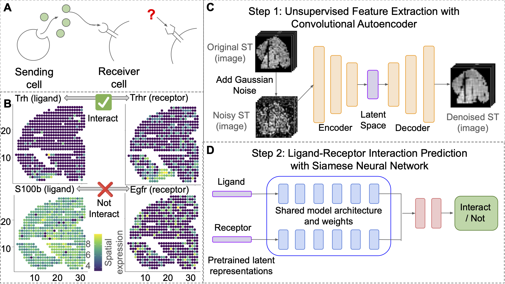

# ggPair: gene-gene Pair

This repository contains the code to reproduce the results in our manuscript "Predicting Ligand-Receptor Pairing using Spatial Transcriptomics".



## Requirements

- Python 3.10+
- CUDA-capable GPU
- ~32GB RAM
- ~50GB disk space for data and results

## Installation

```bash
# Clone repository
git clone https://github.com/songlab-cal/ggPair.git
cd ggPair

# Create conda environment
conda create -n ggpair python=3.12
conda activate ggpair

# Install dependencies
pip install -r requirements.txt
```

## Data Download
### Human Spatial Transcriptomics Data

```bash
# Install gdown if not already installed
pip install gdown

# Download spatial transcriptomics benchmark data
gdown 1BiXROO5eetEInRwMbiA51Aw1eKo2v2Cx -O data/spatial_benchmark.zip

# Extract only the required datasets (7, 23, 24)
cd data
unzip spatial_benchmark.zip "DataUpload/Dataset7/*" "DataUpload/Dataset23/*" "DataUpload/Dataset24/*"
cd ..
```

### Mouse Brain Data

Raw and normalized count matrices are available via the GEO database ([GEO accession GSE152506](https://www.ncbi.nlm.nih.gov/geo/query/acc.cgi?acc=GSE152506)).  
Data and images from in situ sequencing are also available on [Synapse.org](https://www.synapse.org/#!Synapse:syn22156888).

## Reproducing Results
### Human Spatial Transcriptomics Analysis
Run the complete pipeline for human ST data:

- Dataset 7 corresponds to Human osteosarcoma data (BC22).
- Dataset 23 corresponds to Human breast cancer data (CID4465).
- Dataset 24 corresponds to Human breast cancer data (CID44971).
```bash
cd ggPair  # Make sure you're in the project root

# 1. Preprocess spatial transcriptomics data
python scripts_human/01_preprocess_ST_data.py

# 2. Train Convolutional Autoencoders (CAE) and extract embeddings
python scripts_human/02_train_CAE.py

# 3. Train Siamese Neural Networks (SNN) with 5-fold cross-validation
python scripts_human/03_train_SNN_5foldcv.py

# 4. (Optional) Evaluate model performance
python scripts_human/04_evaluate_5foldcv.py

# 5. (Optional) Run Leave-One-Out Cross-Validation (LOOCV)
# For GPCR receptors only (default)
python scripts_human/05_train_SNN_loocv.py --all-datasets

# For non-GPCR receptors
python scripts_human/05_train_SNN_loocv.py --all-datasets --gpcr-only false
```

### Mouse Brain Analysis
Run the pipeline for mouse brain spatial transcriptomics with multiple biological batches:
```bash
cd ggPair  # Make sure you're in the project root

# 1. Preprocess mouse brain data
python scripts_mouse/01_preprocess_ST_data.py

# 2. Batch correction
python scripts_mouse/02_batch_correction.py

# 3. Prepare CAE input data
python 03_preprocess_CAE_input_data.py

# 4. Train CAE models
python scripts_mouse/04_train_CAE.py

# 5. Train SNN models
python scripts_mouse/05_train_SNN_5foldcv.py

# 6. (Optional) Run Leave-One-Out Cross-Validation (LOOCV)
# For GPCR receptors only (default)
python scripts_mouse/06_train_SNN_loocv.py --all-datasets

# For non-GPCR receptors
python scripts_mouse/06_train_SNN_loocv.py --all-datasets --gpcr-only false
```

### Output Structure
After running the pipeline, results will be organized as follows:
```
results/
├── preprocessed/       # Preprocessed data files
├── models/            # Trained CAE models
├── embeddings/        # Extracted gene embeddings
├── fig/              # Generated figures
├── snn/              # Trained SNN models
│   ├── 5foldcv_*/    # 5 fold CV results
│   └── loocv_*/      # LOOCV results
└── evaluation/       # Performance metrics and comparisons
```

### Expected Runtime

- Data preprocessing: ~30 minutes per dataset
- CAE training: ~2 hours per dataset (100 epochs)
- SNN training (5-fold CV): ~4 hours per dataset (20 seeds × 5 folds)
- LOOCV: ~13-14 hours per dataset (20 seeds)
- Total runtime: ~20-24 hours for all three human datasets

### Custom Dataset Usage
To apply ggPair to your own spatial transcriptomics data:

1. Prepare your data in the required format:

    - `Spatial_count.txt`: Gene expression matrix (spots × genes)  
    - `Locations.txt`: Spatial coordinates (`x`, `y` columns)  
    - `filtered_pairs_*.csv`: Known ligand-receptor pairs (optional)

2. Place data in `data/DataUpload/Dataset[ID]/`

3. Update configuration in scripts:

    - Add dataset ID to the `DATASETS` list  
    - Set appropriate `NORM_SIZE` for your spatial resolution

4. Run the pipeline as described above.